# Alphard Bali - Website Sewa Mobil Alphard Premium

Website **dinamis** profesional untuk Alphard Bali, bisnis penyewaan mobil Alphard premium di Bali dengan fokus pada performa tinggi, animasi GSAP modern, dan SEO-friendly.

---

## Tech Stack

### Frontend

| Technology | Version | Purpose |
|------------|---------|---------|
| **Next.js** | 14.x (App Router) | React framework dengan SSR/SSG |
| **TypeScript** | 5.x | Type safety |
| **GSAP** | 3.12.x | Animasi premium + ScrollTrigger |
| **Tailwind CSS** | 3.x | Styling |
| **shadcn/ui** | latest | UI components |

### Backend

| Technology | Version | Purpose |
|------------|---------|---------|
| **Laravel** | 11.x | REST API backend |
| **PostgreSQL** | 16.x | Database |
| **Redis** | 7.x | Caching & sessions |
| **Laravel Sanctum** | - | API authentication |

### Infrastructure

| Technology | Purpose |
|------------|---------|
| **Prisma** | Database ORM (frontend) |
| **next-sitemap** | Dynamic sitemap |
| **Cloudinary/S3** | Media storage |

> [!TIP]
> Menggunakan GSAP exclusively untuk semua animasi untuk konsistensi dan bundle size yang lebih kecil.

---

## Layered Architecture

```mermaid
graph TB
    subgraph Frontend["🎨 Frontend (Next.js)"]
        Pages["App Router Pages"]
        Components["UI Components"]
        GSAP["GSAP Animations"]
        Hooks["Custom Hooks"]
    end
    
    subgraph Backend["⚙️ Backend (Laravel)"]
        API["REST API"]
        Auth["Sanctum Auth"]
        Controllers["Controllers"]
        Services["Services"]
        Models["Eloquent Models"]
    end
    
    subgraph Data["� Data Layer"]
        PostgreSQL[(PostgreSQL)]
        Redis[(Redis Cache)]
        Storage["File Storage"]
    end
    
    Pages --> API
    Components --> GSAP
    API --> Controllers
    Controllers --> Services
    Services --> Models
    Models --> PostgreSQL
    API --> Redis
```



### Struktur Folder

```
alphardbali/
├── frontend/                     # Next.js Frontend
│   ├── src/
│   │   ├── app/                  # App Router
│   │   │   ├── (main)/           # Public pages
│   │   │   ├── admin/            # Admin panel
│   │   │   └── api/              # API routes
│   │   ├── components/
│   │   │   ├── ui/               # shadcn/ui
│   │   │   ├── layout/           # Header, Footer
│   │   │   ├── sections/         # Page sections
│   │   │   └── animations/       # GSAP components
│   │   ├── hooks/                # Custom hooks
│   │   ├── lib/                  # Utilities
│   │   │   ├── api.ts            # API client
│   │   │   ├── gsap/             # GSAP config
│   │   │   └── seo/              # SEO utilities
│   │   ├── types/                # TypeScript types
│   │   └── constants/            # Constants
│   └── public/
│
├── backend/                      # Laravel Backend
│   ├── app/
│   │   ├── Http/
│   │   │   ├── Controllers/
│   │   │   │   ├── Api/          # API Controllers
│   │   │   │   └── Admin/        # Admin Controllers
│   │   │   └── Middleware/
│   │   ├── Models/               # Eloquent Models
│   │   ├── Services/             # Business Logic
│   │   └── Repositories/         # Data Access
│   ├── database/
│   │   ├── migrations/
│   │   └── seeders/
│   └── routes/
│       └── api.php
│
└── docs/                         # Documentation
```

---

## Database Schema

```mermaid
erDiagram
    VEHICLES ||--o{ BOOKINGS : has
    VEHICLES ||--o{ VEHICLE_IMAGES : has
    SERVICES ||--o{ BOOKINGS : includes
    CUSTOMERS ||--o{ BOOKINGS : makes
    TESTIMONIALS }o--|| CUSTOMERS : from
    
    VEHICLES {
        int id PK
        string name
        string slug
        string type
        text description
        json specifications
        decimal price_per_day
        boolean is_active
        timestamps
    }
    
    SERVICES {
        int id PK
        string name
        string slug
        text description
        string icon
        decimal price
        boolean is_active
        timestamps
    }
    
    BOOKINGS {
        int id PK
        int customer_id FK
        int vehicle_id FK
        date start_date
        date end_date
        string pickup_location
        string dropoff_location
        decimal total_price
        string status
        timestamps
    }
    
    TESTIMONIALS {
        int id PK
        string customer_name
        string customer_photo
        text content
        int rating
        boolean is_featured
        timestamps
    }
    
    PAGES {
        int id PK
        string title
        string slug
        json content
        json seo_metadata
        timestamps
    }
    
    SETTINGS {
        int id PK
        string key
        json value
        timestamps
    }
    
    FAQS {
        int id PK
        string question
        text answer
        int order
        boolean is_active
        timestamps
    }
```

---

## Development Phases

### Phase 1: Foundation (Week 1-2)

#### 1.1 Project Setup

- [ ] Initialize Next.js 14 project dengan TypeScript
- [ ] Setup Tailwind CSS dan shadcn/ui
- [ ] Initialize Laravel 11 project
- [ ] Setup PostgreSQL database
- [ ] Configure environment variables
- [ ] Setup Git repository

#### 1.2 Backend Foundation

- [ ] Create database migrations
- [ ] Setup Eloquent models
- [ ] Configure Laravel Sanctum
- [ ] Create base API structure
- [ ] Setup Redis caching

#### 1.3 Frontend Foundation

- [ ] Setup project structure
- [ ] Configure GSAP dengan dynamic imports
- [ ] Create design system (colors, typography)
- [ ] Build reusable UI components
- [ ] Setup API client dengan Axios/fetch

---

### Phase 2: Core Features (Week 3-4)

#### 2.1 Public API Endpoints

- [ ] `GET /api/vehicles` - List vehicles
- [ ] `GET /api/vehicles/{slug}` - Vehicle detail
- [ ] `GET /api/services` - List services
- [ ] `GET /api/testimonials` - Testimonials
- [ ] `GET /api/faqs` - FAQ list
- [ ] `GET /api/settings` - Site settings
- [ ] `POST /api/bookings` - Create booking
- [ ] `POST /api/contact` - Contact form

#### 2.2 Public Pages

- [ ] Homepage dengan semua sections
- [ ] Fleet/Armada page
- [ ] Services/Layanan page
- [ ] About/Tentang page
- [ ] Contact/Kontak page
- [ ] Vehicle detail page

#### 2.3 GSAP Animations

- [ ] Hero section animations (text reveal, parallax)
- [ ] Scroll-triggered section reveals
- [ ] Vehicle card 3D hover effects
- [ ] Counter animations
- [ ] Navigation magnetic effects
- [ ] Page transitions

---

### Phase 3: Admin Panel (Week 5-6)

#### 3.1 Admin Authentication

- [ ] Admin login page
- [ ] JWT/Sanctum token management
- [ ] Protected admin routes
- [ ] Role-based access control

#### 3.2 Admin Dashboard

- [ ] Dashboard overview (stats, recent bookings)
- [ ] Booking management CRUD
- [ ] Vehicle management CRUD
- [ ] Service management CRUD
- [ ] Testimonial management CRUD
- [ ] FAQ management CRUD
- [ ] Settings management
- [ ] Media library

#### 3.3 Admin API Endpoints

- [ ] `POST /api/admin/login`
- [ ] `GET /api/admin/dashboard`
- [ ] CRUD endpoints for all entities
- [ ] File upload endpoints
- [ ] Bulk operations

---

### Phase 4: Polish & Launch (Week 7-8)

#### 4.1 SEO Optimization

- [ ] Dynamic meta tags per page
- [ ] JSON-LD structured data
- [ ] Dynamic sitemap generation
- [ ] Robots.txt configuration
- [ ] Open Graph images

#### 4.2 Performance Optimization

- [ ] Image optimization pipeline
- [ ] GSAP lazy loading
- [ ] API response caching
- [ ] Database query optimization
- [ ] CDN setup

#### 4.3 Testing & QA

- [ ] Cross-browser testing
- [ ] Mobile responsiveness testing
- [ ] Animation performance testing
- [ ] Lighthouse audit (target: 90+)
- [ ] Security audit

#### 4.4 Deployment

- [ ] Frontend deployment (Vercel)
- [ ] Backend deployment (Railway/Render)
- [ ] Database setup (production)
- [ ] DNS & SSL configuration
- [ ] Monitoring setup

---

## GSAP Animation Strategy

### Key Animations

| Section | Animation Type | Trigger |
|---------|---------------|---------|
| Hero | Split text reveal + parallax | On load |
| Navigation | Magnetic hover + morph | On hover |
| Fleet Cards | 3D tilt + scale | On hover / scroll |
| Stats | Counter animation | ScrollTrigger |
| Testimonials | Fade & slide carousel | Auto / manual |
| CTA | Gradient shift + pulse | ScrollTrigger |

### Performance Principles

1. **Hardware Acceleration** - Use `transform` dan `opacity`
2. **Lazy Loading** - Dynamic import GSAP plugins
3. **Reduced Motion** - Respect `prefers-reduced-motion`
4. **60fps Target** - Optimize all animations

---

## SEO Strategy

### JSON-LD Structured Data

```json
{
  "@context": "https://schema.org",
  "@type": "AutoRental",
  "name": "Alphard Bali",
  "description": "Layanan sewa mobil Alphard premium di Bali",
  "url": "https://alphardbali.com",
  "areaServed": { "@type": "Place", "name": "Bali, Indonesia" },
  "priceRange": "$$$$"
}
```

### Target Keywords

- sewa alphard bali
- rental alphard bali
- sewa mobil mewah bali
- alphard dengan supir bali

---

## Performance Targets

| Metric | Target |
|--------|--------|
| **LCP** | < 2.5s |
| **FID** | < 100ms |
| **CLS** | < 0.1 |
| **Lighthouse** | > 90 |

---

## Verification Plan

### Automated

```bash
npm run build          # Build verification
npm run lint           # Lint check
npm run type-check     # Type checking
php artisan test       # Backend tests
```

### Manual

1. Visual testing di desktop/mobile
2. Animation performance check
3. SEO validation (Google Rich Results Test)
4. Cross-browser testing
